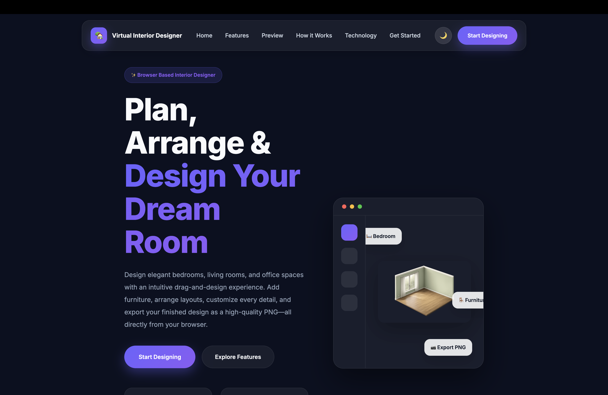
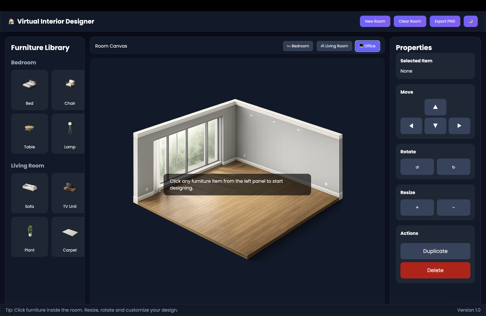
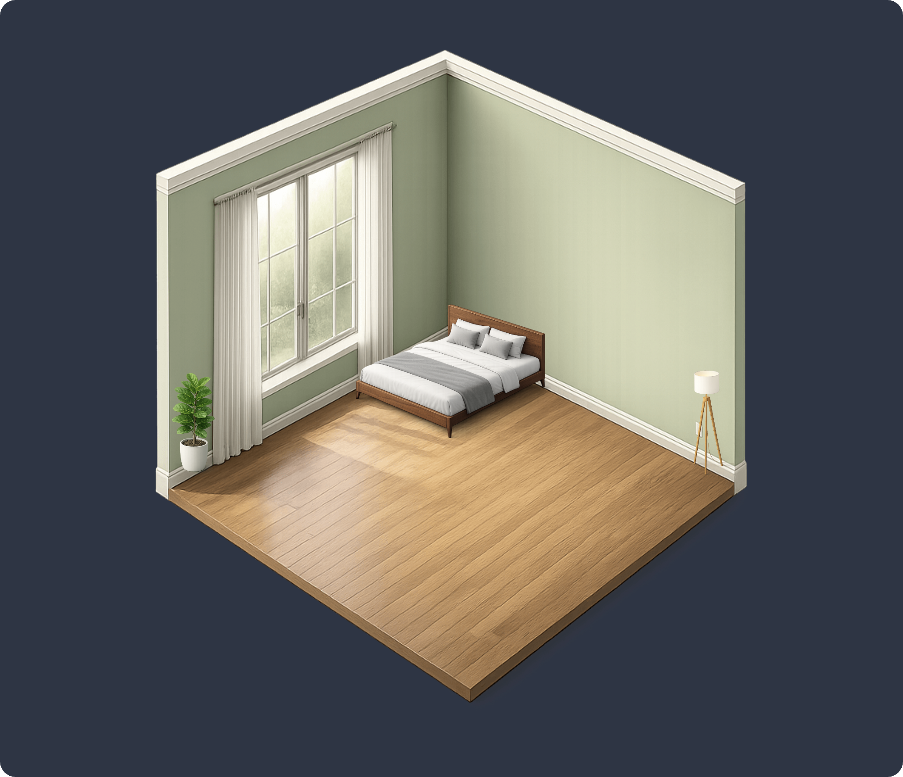
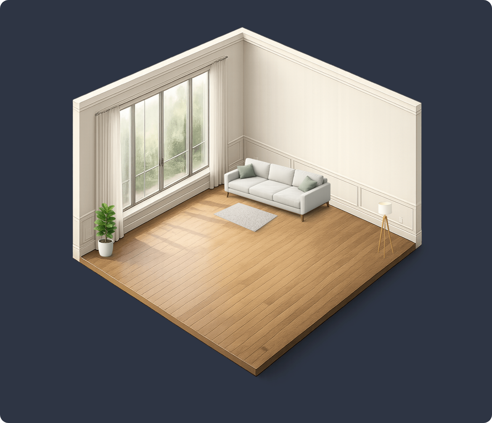

# 🏠 Virtual Interior Designer

> **Design your dream space, one room at a time.**

A modern **browser-based Virtual Interior Designer** built using **HTML, CSS, and JavaScript**. Create elegant bedrooms, living rooms, and office spaces by placing, arranging, rotating, resizing, and customizing furniture in professionally designed room templates—all directly from your browser without installing any software.

---

# 🌐 Live Demo

> 🔗 **Coming Soon**

*(Add your GitHub Pages or Netlify link here after deployment.)*

---

# 📸 Preview

## Landing Page



## Designer Workspace



## Bedroom Design



## Living Room Design



---

# ✨ Features

## 🛋 Furniture Library

- Modern furniture collection
- Add furniture with one click
- Multiple furniture support
- Transparent PNG furniture assets
- Interactive furniture selection

### Available Furniture

- 🛏 Bed
- 🛋 Sofa
- 🪑 Chair
- ☕ Table
- 📺 TV Unit
- 🌿 Plant
- 💡 Lamp
- 🧺 Carpet

---

## 🏡 Room Templates

Instantly switch between professionally designed room templates.

- 🛏 Bedroom
- 🛋 Living Room
- 💻 Office

---

## 🎨 Furniture Editing

Customize every object inside your room.

- Move furniture
- Resize furniture
- Rotate furniture
- Duplicate furniture
- Delete furniture
- Select multiple items individually
- Maintain object layering

---

## 📤 Export Design

Export your finished room design as a **high-quality PNG image** using **html2canvas**.

---

## 🌙 Theme Support

- Dark Mode
- Light Mode
- Theme synchronization between Landing Page and Designer Workspace using Local Storage

---

## 📱 Responsive Design

Optimized for

- 💻 Desktop
- 🖥 Laptop
- 📱 Tablet
- 📲 Mobile

---

## ⌨ Keyboard Shortcuts

| Shortcut | Action |
|----------|--------|
| ↑ ↓ ← → | Move Selected Furniture |
| Delete | Delete Selected Furniture |
| R | Rotate Right |
| Shift + R | Rotate Left |
| + | Increase Size |
| - | Decrease Size |
| Ctrl + D | Duplicate Furniture |

---

# 🖼 Assets

This project includes:

- Modern isometric room templates
- Transparent furniture PNG assets
- Responsive user interface
- Glassmorphism-inspired design
- Modern iconography

---

# 🛠 Built With

- HTML5
- CSS3
- JavaScript (ES6)
- DOM Manipulation
- CSS Flexbox
- CSS Grid
- Local Storage
- html2canvas

---

# 📂 Project Structure

```text
VirtualInteriorDesigner
│
├── index.html
├── designer.html
├── README.md
│
├── css
│   ├── style.css
│   └── designer.css
│
├── js
│   ├── app.js
│   └── designer.js
│
├── assets
│   ├── furniture
│   ├── rooms
│   ├── icons
│   └── textures
│
└── screenshots
```

---

# 🚀 Getting Started

## 1. Clone the Repository

```bash
git clone https://github.com/Blahari1/Virtual-Interior-Designer.git
```

## 2. Open the Project

Open the project folder in **Visual Studio Code**.

## 3. Run the Application

Install the **Live Server** extension.

Right-click on **index.html**

Select

```text
Open with Live Server
```

The application will launch in your browser.

---

# 🌍 Browser Support

- Google Chrome ✅
- Microsoft Edge ✅
- Mozilla Firefox ✅
- Safari ✅

---

# 🎯 Future Enhancements

- Save & Load Designs
- Undo / Redo
- Snap-to-Grid
- Furniture Search
- Kitchen Templates
- Bathroom Templates
- Drag Resize Handles
- Rotation Handles
- Furniture Categories
- Layer Management
- AI Room Suggestions
- Cloud Storage
- User Accounts
- 3D Furniture Models

---

# 📚 What I Learned

This project helped me strengthen my skills in:

- HTML5 Structure
- Modern CSS
- Responsive Web Design
- CSS Grid & Flexbox
- JavaScript (ES6)
- DOM Manipulation
- Event Handling
- Drag-and-Drop Interactions
- Object Selection
- State Management
- Local Storage
- Canvas Export
- User Interface Design
- Responsive Application Development

---

# 👨‍💻 Author

**Lahari**

GitHub: https://github.com/Blahari1

---

# 📄 License

This project is developed for **educational and portfolio purposes**.

---

# ⭐ Support

If you found this project helpful, consider giving it a **⭐ Star** on GitHub.

It helps others discover the project and supports future improvements.

---
